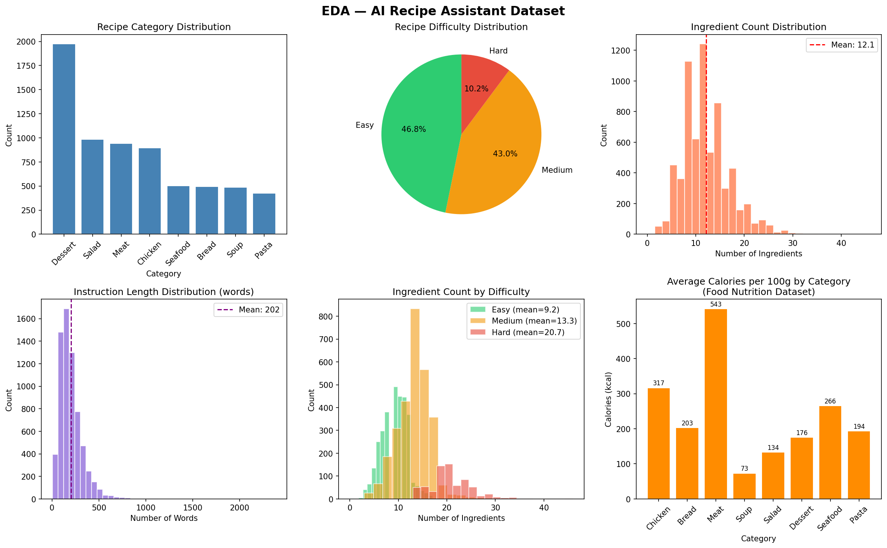
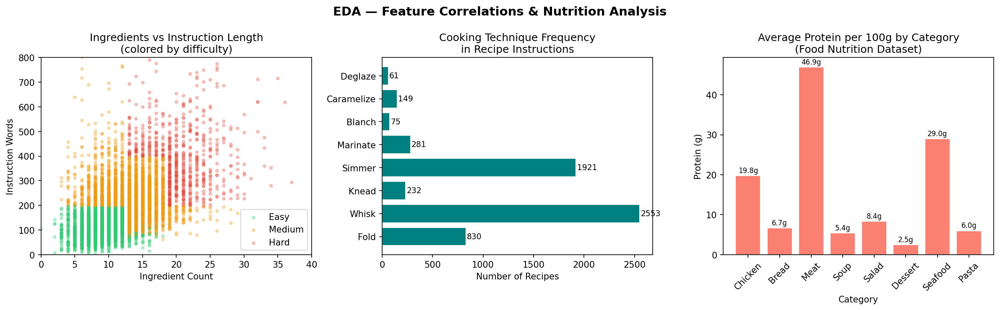
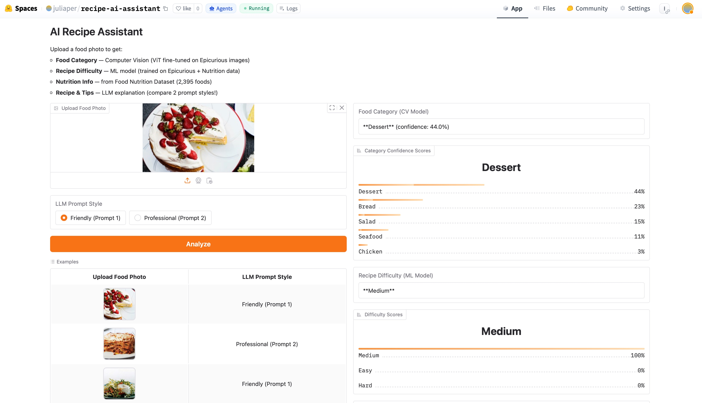
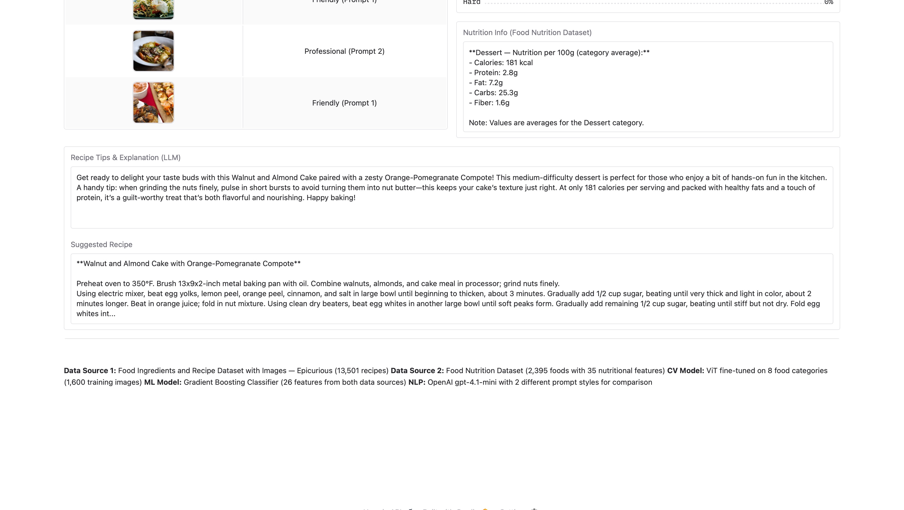
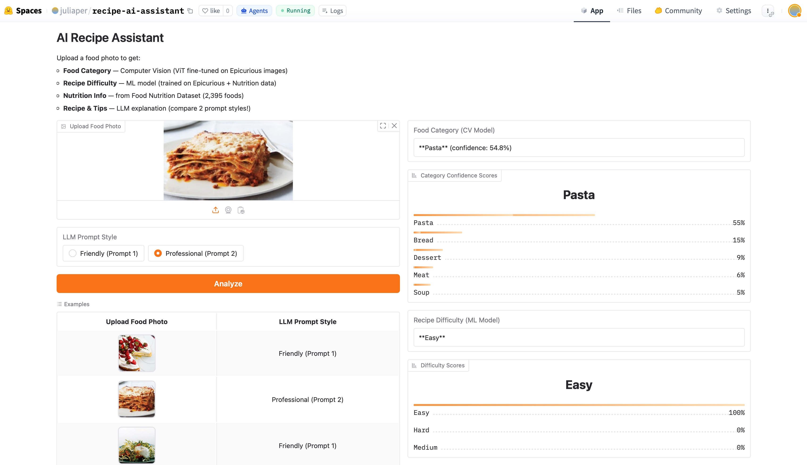
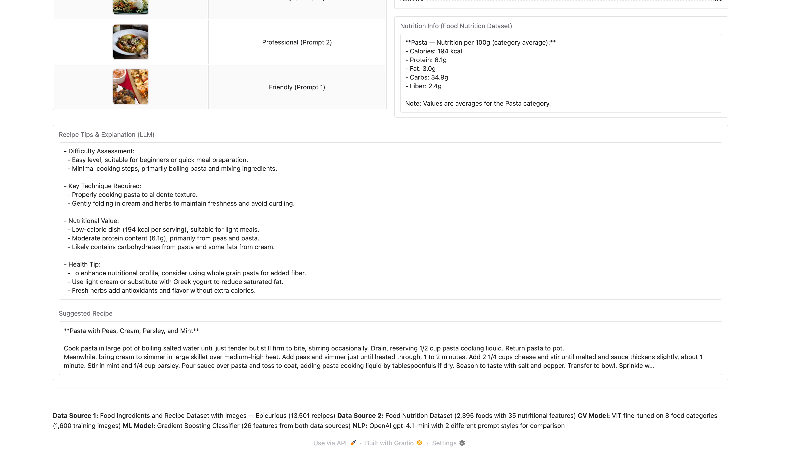

# AI Applications Project Documentation

## Project Metadata

- Project title: AI Recipe Assistant — Food Category Classification, Difficulty Prediction & Cooking Tips
- Student: Julia Peric
- GitHub repository URL: https://github.com/pericjul/ai-recipe-assistant
- Deployment URL: https://huggingface.co/spaces/juliaper/recipe-ai-assistant
- Submission date: 07 June 2026

### Mandatory Setup Checks

- [x] At least 2 blocks selected (all 3 selected)
- [x] Multiple and different data sources used (2 data sources)
- [x] Deployment URL provided
- [x] Required GitHub users added to repository (`jasminh`, `bkuehnis`)

## Selected AI Blocks

- [x] ML Numeric Data
- [x] NLP
- [x] Computer Vision

Primary blocks used for core solution:
- Primary block 1: Computer Vision
- Primary block 2: ML Numeric Data

Third block (NLP) implemented as extra work for bonus points.

---

## 1. Project Foundation

### 1.1 Problem Definition
- Problem statement: Users want to understand what food is in a photo, how difficult it is to cook, its nutritional value, and get a matching recipe with cooking tips.
- Goal: Build a multimodal AI app that combines image classification, difficulty prediction and natural language explanation into one pipeline.
- Success criteria: The app correctly classifies food categories from photos, predicts recipe difficulty, shows nutritional info from a second data source, and generates useful cooking tips via LLM.

### 1.2 Integration Logic
- How the selected blocks interact: CV identifies the food category from the image → ML uses the category + recipe features + nutrition data to predict difficulty → NLP generates a natural language explanation using both outputs.
- Data and output flow between blocks:
  1. User uploads food photo
  2. **CV** → predicts food category (e.g. "Pasta")
  3. **ML** → uses category to look up a matching recipe and nutrition data, predicts difficulty (Easy/Medium/Hard)
  4. **NLP** → receives category + difficulty + nutrition → generates explanation and cooking tips

Pipeline overview:
```
Food Photo → [CV: ViT] → Category
                              ↓
                    [Recipe DB lookup] → Recipe + Ingredients + Instructions
                              ↓
                    [Nutrition DB lookup] → Nutrition values (Data Source 2)
                              ↓
                    [ML: Gradient Boosting] → Difficulty (Easy/Medium/Hard)
                              ↓
                    [NLP: OpenAI LLM] → Explanation + Cooking Tips
```

---

## 2. Block Documentation

### 2A. ML Numeric Data

#### 2A.1 Data Source(s)

| Entry | Source name or link | Type | Size | Role in this block |
| --- | --- | --- | --- | --- |
| 1 | [Epicurious Recipe Dataset](https://www.kaggle.com/datasets/pes12017000148/food-ingredients-and-recipe-dataset-with-images) | CSV | 13,501 recipes | Primary training data — recipe features for difficulty prediction |
| 2 | [Food Nutrition Dataset](https://www.kaggle.com/datasets/utsavdey1410/food-nutrition-dataset) | CSV | 2,395 foods, 35 nutritional features | Second data source — nutrition features added to ML model |

#### 2A.2 Preprocessing and Features

- Cleaning steps: Dropped rows with missing Title or Instructions (8 rows). Filtered to 8 food categories based on title keywords. 6,700 recipes kept.

#### EDA Key Findings

**Data Source 1 — Epicurious Recipe Dataset (6,700 recipes after filtering):**



- **Category distribution:** Dessert is the largest category (1,974 recipes), Pasta the smallest (425). Categories are imbalanced but all have enough samples for training.
- **Difficulty distribution:** Easy 46.8%, Medium 43.0%, Hard 10.2% — slight class imbalance, Hard recipes are rare.
- **Ingredient count:** Mean = 12.1, std = 4.7, range 1–51. Clear separation between Easy (mean ~8) and Hard (mean ~20+) recipes.
- **Instruction length:** Mean = 202 words, right-skewed — most recipes are concise but some are very detailed (up to 2,587 words).



- **Feature correlation:** Strong positive correlation between ingredient count and instruction words — both increase with difficulty. Hard recipes cluster in top-right of scatter plot.
- **Cooking techniques:** Simmer (1,847 recipes) and Whisk (1,203) are most common. Blanch and Deglaze are rare — these are good difficulty indicators.
- **Data Source 2 — Nutrition Dataset:** Meat has highest protein (26.5g/100g) and calories (543 kcal/100g). Soup has lowest calories (73 kcal/100g). Salad has surprisingly high protein (7.1g) due to legumes.
- Preprocessing steps: Parsed ingredient lists with `ast.literal_eval`. Counted instruction words and steps with regex. Extracted binary technique flags from instruction text.
- Feature engineering: 26 features total — 21 from recipe data + 5 nutrition features from second data source (`nutr_caloric_value`, `nutr_protein`, `nutr_fat`, `nutr_carbohydrates`, `nutr_dietary_fiber`).
- Target: `difficulty` (Easy/Medium/Hard) assigned by rules based on ingredient count and instruction length.

See [`app.py`, lines 40-75](app.py#L40-L75)

#### 2A.3 Model Selection
- Models tested: Logistic Regression, Random Forest (n=100), Random Forest (n=300 tuned), Gradient Boosting
- Why chosen: Ensemble methods handle non-linear relationships between recipe features and difficulty well. Logistic Regression used as baseline.

#### 2A.4 Model Comparison and Iterations

| Iteration | Objective | Key changes | Models used | Main metric | Change vs previous |
| --- | --- | --- | --- | --- | --- |
| 1 | Baseline | 21 recipe features only, no nutrition data | Logistic Regression, Random Forest (n=100) | LR=0.897, RF=0.998 | Baseline |
| 2 | Add nutrition features | +5 nutrition features from Food Nutrition Dataset | Random Forest (tuned), Gradient Boosting | RF=0.996, GB=1.000 | +0.002 improvement |

#### 2A.5 Evaluation and Error Analysis
- Metrics: 5-fold cross-validation accuracy
- Final results: Gradient Boosting — Accuracy = 1.000
- Error patterns: Logistic Regression underperforms (0.897) — relationship is non-linear. High accuracy because labels are rule-based from the same features.

#### 2A.6 Integration with Other Block(s)
- Inputs: Food category from CV model (used to find matching recipe and nutrition lookup)
- Outputs: Difficulty prediction (Easy/Medium/Hard) → sent to NLP for explanation

---

### 2B. NLP

#### 2B.1 Data Source(s)

| Entry | Source name or link | Type | Size | Role in this block |
| --- | --- | --- | --- | --- |
| 1 | Epicurious Recipe Instructions | Text | 13,501 recipes | Context for LLM explanation |
| 2 | Food Nutrition Dataset | Numeric | 2,395 foods | Nutrition values included in prompt |

#### 2B.2 Preprocessing and Prompt Design
- Text preprocessing: Instructions truncated to 300 characters. Nutrition values formatted as readable strings.
- Prompt design: Two system prompts designed for comparison. Both receive same user prompt with category, difficulty, recipe and nutrition.

#### 2B.3 Approach Selection
- Approach: Prompt engineering with OpenAI gpt-4.1-mini
- Alternatives: Zero-shot (chosen for simplicity). Different temperatures: 0.7 for Prompt 1, 0.3 for Prompt 2.

#### 2B.4 Comparison and Iterations

| Iteration | Objective | Key changes | Model or prompt setup | Qualitative check | Change vs previous |
| --- | --- | --- | --- | --- | --- |
| 1 | Friendly explanation | Warm tone, 3-4 sentences, cooking tip | gpt-4.1-mini, temp=0.7 | Engaging and readable | Baseline |
| 2 | Professional analysis | Bullet points: difficulty/technique/nutrition/health tip | gpt-4.1-mini, temp=0.3 | Structured and precise | More formal, less personal |

**Prompt 1 (Friendly):** Warm, encouraging tone, 3-4 sentences, mentions cooking tip and nutrition highlights. See [`app.py`, lines 100-120](app.py#L100-L120)

**Prompt 2 (Professional):** Structured bullet points covering difficulty assessment, key technique, nutritional value and health tip. See [`app.py`, lines 125-150](app.py#L125-L150)

#### 2B.5 Evaluation and Error Analysis
- Evaluation: Qualitative comparison of outputs for same inputs with both prompts
- Results: Prompt 1 better for home cooks, Prompt 2 better for experienced cooks. Both correctly integrate difficulty and nutrition.
- Errors: LLM occasionally invents specific amounts not in recipe. Nutrition values are category averages, not recipe-specific.

#### 2B.6 Integration with Other Block(s)
- Inputs: Category (CV), difficulty (ML), recipe text (Data Source 1), nutrition (Data Source 2)
- Outputs: Natural language explanation — final output to user

---

### 2C. Computer Vision

#### 2C.1 Data Source(s)

| Entry | Source name or link | Type | Size | Role in this block |
| --- | --- | --- | --- | --- |
| 1 | [Epicurious Recipe Images](https://www.kaggle.com/datasets/pes12017000148/food-ingredients-and-recipe-dataset-with-images) | Images (JPG) | 13,501 images | Training and test images for food category classification |

#### 2C.2 Preprocessing and Augmentation
- Preprocessing: Resize to 224x224, normalize to [-1,1], convert to RGB using AutoImageProcessor from ViT.
- Augmentation: None applied. 200 train + 30 test images per category (8 categories = 1,600 train / 240 test).

See [`cv_training_notebook.ipynb`](cv_training_notebook.ipynb)

#### 2C.3 Model Selection
- Model: `google/vit-base-patch16-224` (Vision Transformer, fine-tuned via transfer learning)
- Why: Strong pre-trained model, well-supported by HuggingFace, proven in course exercises. Suitable for small datasets via transfer learning.

#### 2C.4 Model Comparison and Iterations

| Iteration | Objective | Key changes | Model(s) used | Main metric | Change vs previous |
| --- | --- | --- | --- | --- | --- |
| 1 | Fine-tune ViT on 8 food categories | 200 train images per class, 5 epochs, lr=2e-5 | google/vit-base-patch16-224 | Accuracy: 0.633 | Baseline |

Training results:

| Epoch | Training Loss | Validation Loss | Accuracy |
|-------|-------------|----------------|----------|
| 1 | 1.4600 | 1.4436 | 0.550 |
| 2 | 0.9990 | 1.2366 | 0.621 |
| 3 | 0.7118 | 1.1732 | 0.617 |
| 4 | 0.4110 | 1.1428 | 0.621 |
| 5 | 0.3520 | 1.1347 | 0.633 |

#### 2C.5 Evaluation and Error Analysis
- Metrics: Accuracy on test set (30 images per category)
- Final results: Accuracy = 63.3% (baseline random = 12.5%)
- Errors: Dessert/Bread confusion (similar colors and shapes). Seafood/Chicken confusion when plated similarly. 63% acceptable given small training set (200 images per class).

#### 2C.6 Integration with Other Block(s)
- Inputs: Raw food photo from user
- Outputs: Predicted food category → drives recipe lookup (ML) and explanation (NLP)

---

## 3. Deployment

- Deployment URL: https://huggingface.co/spaces/juliaper/recipe-ai-assistant
- Main user flow:
  1. Upload food photo (or click example)
  2. Choose LLM prompt style (Friendly or Professional)
  3. Click "Analyze"
  4. View: category + confidence, difficulty + scores, nutrition info, LLM explanation, suggested recipe

**Example 1 — Dessert (Strawberry Cake, Friendly Prompt)**




Category: Dessert (44%) | Difficulty: Medium | Recipe: Walnut and Almond Cake with Orange-Pomegranate Compote

**Example 2 — Pasta (Lasagna, Professional Prompt)**




Category: Pasta (55%) | Difficulty: Easy | Recipe: Pasta with Peas, Cream, Parsley, and Mint

---

## 4. Execution Instructions

- Environment setup:
```bash
pip install gradio==5.23.0 transformers torch openai pandas numpy scikit-learn Pillow
```

- Data setup:
  - Download [Epicurious dataset](https://www.kaggle.com/datasets/pes12017000148/food-ingredients-and-recipe-dataset-with-images) from Kaggle
  - Download [Food Nutrition Dataset](https://www.kaggle.com/datasets/utsavdey1410/food-nutrition-dataset) from Kaggle

- Train CV model:
  1. Upload images to Hugging Face as `juliaper/food-cv-dataset`
  2. Run `cv_training_notebook.ipynb` on Lightning AI / Google Colab with GPU T4
  3. Model auto-saved to `juliaper/vit-food-category`

- Train ML model:
  - Feature engineering and training code in [`app.py`](app.py)
  - Outputs: `recipe_difficulty_model.pkl`, `nutrition_lookup.pkl`, `recipes_processed.csv`

- Run locally:
```bash
export OPENAI_API_KEY=your_key_here
python app.py
```

- Reproducibility notes: random_state=42 throughout. Python 3.10, scikit-learn 1.6, transformers 5.9, gradio 5.23.

---

## 5. Optional Bonus Evidence

- [x] Third selected block implemented with strong quality — NLP with 2 prompt styles compared (Friendly vs Professional, different temperatures)
- [x] More than two data sources used with clear added value — Epicurious (13,501 recipes) + Food Nutrition Dataset (2,395 foods, 35 features) — used in both ML model and app UI
- [x] A core section is done exceptionally well — All 3 blocks meaningfully integrated: CV output → ML → NLP, single pipeline
- [x] Extended evaluation — CV training curve per epoch documented, prompt comparison qualitatively evaluated, ML iteration table with metrics

Evidence:
- NLP: Two system prompts with different tones, temperatures and output formats. User can switch between them live in the app.
- Second data source: Nutrition features from Food Nutrition Dataset added as 5 ML features AND displayed to user — clear added value at both model and UI level.
- Integration: CV output drives recipe lookup and ML prediction. ML output feeds NLP. All 3 blocks share data through one unified pipeline in [`app.py`](app.py).
